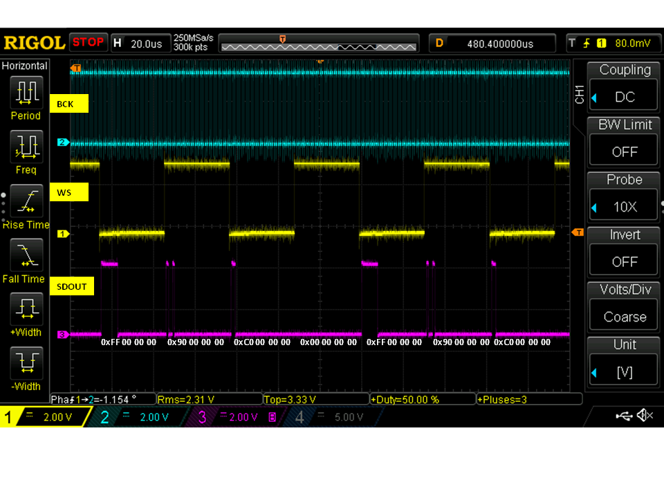
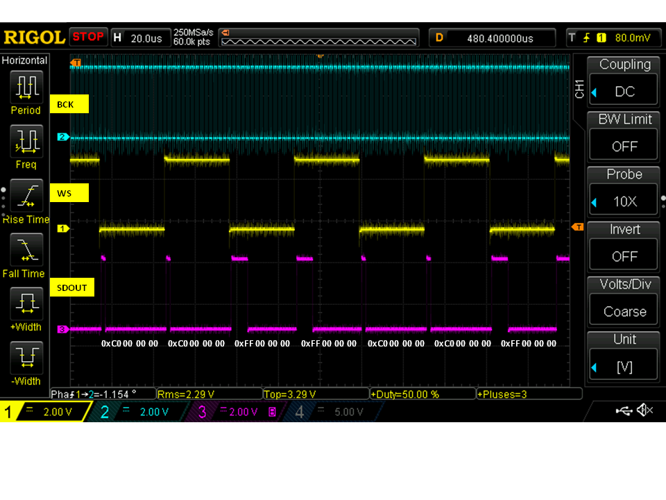
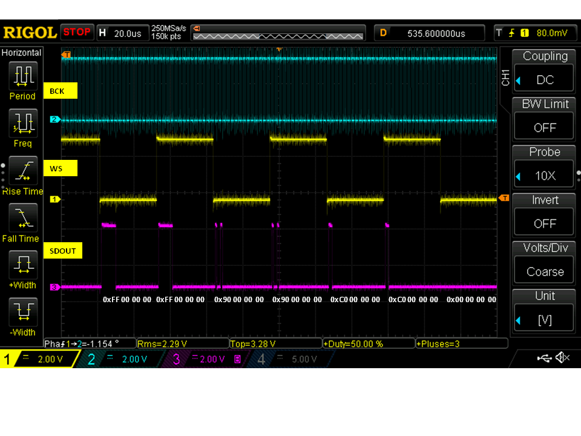
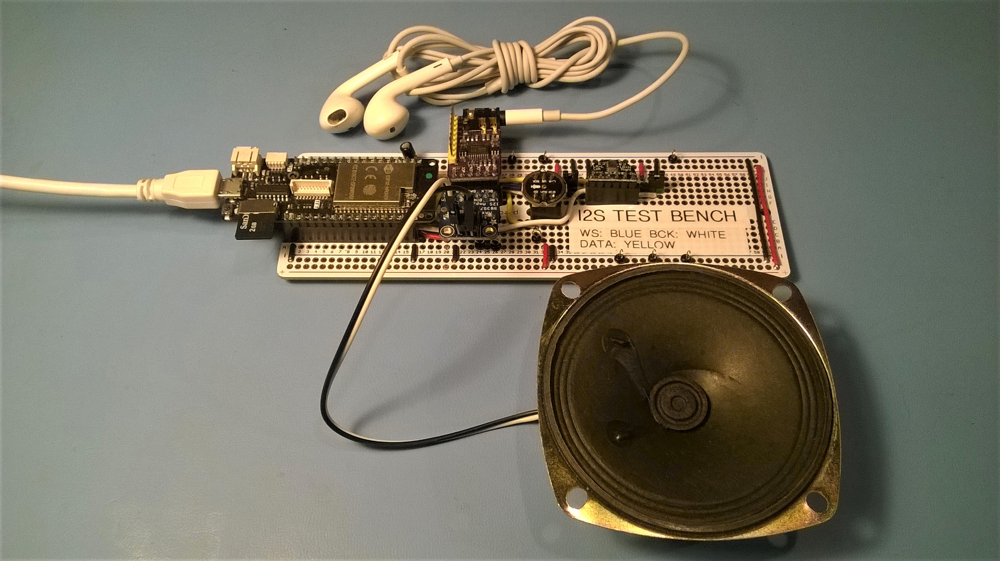
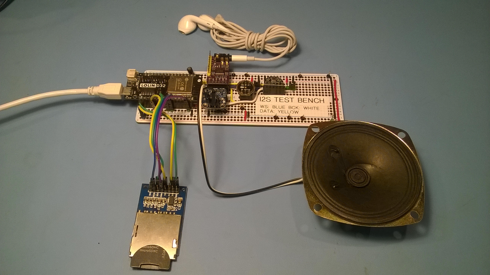

# MicroPython I2S Guide and Examples for ESP32

This guide outlines the capabilities of a new MicroPython [I2S](https://en.wikipedia.org/wiki/I%C2%B2S) class that has been developed for the MicroPython project.  The I2S class works on ESP32 processors and is implemented using Espressif's [ESP-IDF API](https://docs.espressif.com/projects/esp-idf/en/latest/esp32/api-reference/peripherals/i2s.html).  To use I2S with MicroPython you will need to make a custom MicroPython build and integrate a [pull request](https://github.com/micropython/micropython/pull/4471) into the build.  Or, download and program your ESP32 board using one of the pre-built [firmware binaries](firmware).
***
**Example usage - Read audio samples from an I2S microphone module**

```
from machine import I2S
from machine import Pin

bck_pin = Pin(14)  # Bit clock output
ws_pin = Pin(13)   # Word clock output
sdin_pin = Pin(12) # Serial data input

audio_in = I2S(I2S.NUM0,                                 # create I2S peripheral to read audio
               bck=bck_pin, ws=ws_pin, sdin=sdin_pin,    # sample data from an INMP441
               standard=I2S.PHILIPS, mode=I2S.MASTER_RX, # microphone module 
               dataformat=I2S.B32,                       
               channelformat=I2S.RIGHT_LEFT,
               samplerate=16000, 
               dmacount=16,dmalen=256)
               
samples = bytearray(2048)                                # bytearray to receive audio samples

num_bytes_read = audio_in.readinto(samples)              # read audio samples from microphone
                                                         # note:  blocks until sample array is full
                                                         # - see optional timeout argument
                                                         # to configure maximum blocking duration       
```
***
**Example usage - Play audio samples through a speaker using an I2S amplifier module**

```
from machine import I2S
from machine import Pin

bck_pin = Pin(14)   # Bit clock output
ws_pin = Pin(13)    # Word clock output
sdout_pin = Pin(12) # Serial data output

audio_out = I2S(I2S.NUM1,                                  # create I2S peripheral to write audio
                bck=bck_pin, ws=ws_pin, sdout=sdout_pin,   # sample data to an Adafruit I2S Amplifier
                standard=I2S.PHILIPS, mode=I2S.MASTER_TX,  # breakout board, 
                dataformat=I2S.B16,                        # based on MAX98357A device
                channelformat=I2S.ONLY_RIGHT,
                samplerate=16000, 
                dmacount=16,dmalen=512)
               
samples = bytearray(1024)                                 # bytearray containing audio samples to transmit

num_bytes_written = audio_out.write(samples)              # write audio samples to amplifier
                                                          # note:  blocks until sample array is emptied
                                                          # - see optional timeout argument
                                                          # to configure maximum blocking duration       
```
# class I2S
## Constructor
```
class machine.I2S(id,
                  bck, ws, [sdin], [sdout], 
                  [standard=I2S.PHILIPS], mode, 
                  dataformat, channelformat, 
                  samplerate,
                  [dmacount=16], [dmalen=64],
                  [apllrate=0])
```
Construct and return a new I2S object with the given arguments:
  * **id** specifies I2S peripheral instance
  * **bck** pin object for the bit clock output
  * **ws** pin object for the word select output
  * **sdin** pin object for the serial data input (optional)
  * **sdout** pin object for the serial data output (optional)
  * **standard** protocol used by the I2S peripheral (optional)
  * **mode** specifies receive or transmit
  * **dataformat** number of bits in each sample
  * **channelformat** specifies audio format, e.g. stereo, mono
  * **samplerate** audio sampling rate (samples/s)
  * **dmacount** number of linked DMA buffers (optional)
  * **dmalen** length of each DMA buffer (in samples) (optional)  
  * **apllrate** audio PLL sampling rate (samples/s) (optional)   
  
Notes:  
  * **sdin** must be specified for mode = I2S.MASTER_RX
  * **sdout** must be specified for mode = I2S.MASTER_TX
  * only **one** of **sdin** or **sdout** can be specified
  * **apllrate** allows precise specification of the sampling clock rate.  **Not needed** for most audio applications.  See ESP-IDF docs for usage

## Methods
```
I2S.init(bck, ...)
```
Initialize the I2S peripheral with the given arguments:
  * see Constructor for argument descriptions

***  
```
I2S.deinit()
```

Deinitialize the I2S peripheral

***
```
I2S.readinto(buf, [timeout = -1])
```

Read audio samples from an I2S peripheral with the given arguments:

  * **buf** receive buffer.  Must support buffer protocol, such as bytearray or array  
  * **timeout** maximum time to wait for a DMA buffer (in ms). 
If no DMA buffer is available in **timeout** ms the method will return. Default = wait forever to fill buf.  When timeout=0 the method will return ***immediately*** if there is no data in DMA memory to copy into the supplied buffer.  Timeout=0 can be used to create a non-blocking I2S application with uasyncio.  This is shown in the [example code](examples).  See discussion below on *Understanding the timeout argument* 
  
Notes:  
  * method blocks until buf is *completely* filled from DMA memory, unless timeout is specified 
  * The DMA engine works in the background, filling DMA buffers with audio samples read from the I2S peripheral. The MicroPython runtime is not impacted by this DMA operation.

**Returns** number of bytes read  

***
```
I2S.write(buf, [timeout = -1])
```
Write audio samples to an I2S peripheral with the given arguments:

  * **buf** transmit buffer.  Must support buffer protocol, such as bytearray or array
  * **timeout** maximum time to wait for a DMA buffer (in ms). If no DMA buffer is available in **timeout** ms the function will return.  Default = wait forever to write buf.  When timeout=0 the method will return ***immediately*** if there is no free DMA memory to copy  the transmit buffer.  Timeout=0 can be used to create a non-blocking I2S application with uasyncio.  This is shown in the [example code](examples).  See discussion below on *Understanding the timeout argument*    
    
Notes:  
  * method blocks until buf is *completely* copied to DMA memory, unless timeout is specified 
  * The DMA engine works in the background, transfering audio samples from DMA buffers to the I2S peripheral.  The MicroPython runtime is not impacted by this DMA operation.

**Returns** number of bytes written
***

## Constants

**id** of I2S peripheral

```
I2S.NUM0, I2S.NUM1
```
***

**standard** of I2S peripheral

```
I2S.PHILIPS, I2S.LSB
```
***

**mode** of I2S peripheral

```
I2S.MASTER_RX, I2S.MASTER_TX
```
***

**dataformat** of I2S peripheral

```
I2S.B16, I2S.B24, I2S.B32
```
***

**channelformat** of I2S peripheral

```
I2S.RIGHT_LEFT, I2S.ALL_RIGHT, I2S.ALL_LEFT, I2S.ONLY_RIGHT, I2S.ONLY_LEFT,
```
See section below "Understanding Channel Format"
***
 
### ESP32 Development Boards Tested
  * Adafruit Huzzah Feather ESP32 with external SD card
  * Lolin D32 Pro
  * Lolin D32 with external SD card
  
### I2S Microphone Boards Tested
 * INMP441 microphone module available on ebay, aliexpress, amazon
 * MSM261S4030H0 microphone module available on ebay, aliexpress, amazon
 *  Adafruit I2S MEMS Microphone Breakout - SPH0645LM4H.  **This board is NOT recommended**.  The SPH0645LM4H chip implements non-standard Philips I2S timing.  When used with the ESP32, all audio samples coming from the I2S microphone are shifted to the left by one bit. This increases the sound level by 6dB. More details on this problem are outlined a [StreetSense project log](https://hackaday.io/project/162059-street-sense/log/160705-new-i2s-microphone).  It is unfortunate that the chip manufacturer failed to follow the de-facto [Philips I2S bus specification](https://web.archive.org/web/20070102004400/http://www.nxp.com/acrobat_download/various/I2SBUS.pdf).
  
### I2S DAC and Amplifier Boards Tested
   * Adafruit I2S 3W Class D Amplifier Breakout - MAX98357A
   * I2S PCM5102 Stereo DAC Decoder available on ebay, aliexpress, amazon
   * Wondom 2 x 30W Class D Audio Amplifier Board & DAC, based on TI TAS5756 device

### Pre-built Firmware Binaries
Pre-built firmware binaries that support I2S are available in the [firmware folder](firmware).  Binaries are provided for the regular ESP32 module and the enhanced ESP32 module with external PSRAM.

### DMA considerations
The ESP32 uses [DMA](https://en.wikipedia.org/wiki/Direct_memory_access) to transfer data between a MicroPython application and an I2S hardware peripheral.  DMA memory is implemented as a linked-list of DMA buffers and is specified by the two constructor arguments `dmacount` and `dmalen`.

DMA runs continuously in the background and allows user applications to perform other operations while sample data is transfered between DMA memory and the I2S hardware. In general, more DMA memory = more time that user applications can operate before DMA "undderruns" or "overruns" happen.
  
**DMA memory allocation**

DMA memory is allocated by the ESP32 when either the I2S constructor or the init() method is called.  The following formula provides a close approximation to the total amount of DMA memory allocated (in bytes)

* DMA memory allocation = `dmacount * dmalen * # bytes/sample * # channels` bytes

**Understanding DMA buffer size**

size of each DMA buffer = `dmalen * # bytes/sample * # channels` bytes

where `# channels` refers to mono versus stereo operation:
  * mono = 1 channel, (channelformat=ONLY_RIGHT, ONLY_LEFT)
  * stereo = 2 channels, (channelformat=RIGHT_LEFT, ALL_RIGHT, or ALL_LEFT)

example:  dmalen=128, dataformat=I2S.B32, channelformat=RIGHT_LEFT (e.g. stereo)
  * DMA buffer size= 128 \* 4 \* 2 = 1024 bytes

**Sizing 'buf' for readinto() method**:  For efficient use of DMA memory, the sizeof `buf` should be an *integer multiple* of the DMA buffer size.  For example, with a DMA buffer size = 2000, a good size for buf could be 4000 bytes.  Larger `buf` sizes can be advantageous when writing samples to internal flash memory or external SD cards.  A larger `buf` will permit a continuous bulk write to memory, which is more efficient than multiple small block writes. 

**Sizing 'buf' for write() method**:  Similar to the read method, the sizeof `buf` should ideally be an integer multiple of the DMA buffer size.  For a *simple* design using the `timeout` argument, the sizeof `buf` can be equal to the sizeof the DMA buffer.  Why? The entire contents of `buf` can be written to a DMA memory buffer with one call to the write method - this approach avoids possible design complications of dealing with residual samples remaining in `buf`.

### Understanding the timeout argument
The optional `timeout` argument in the readinto and write methods specifies the maximum amount of time (in ms) that these method calls wait for a DMA buffer to become available. If `timeout = 0` is specified, then the readinto and write methods will return "immediately" (measured ~125us) when:
  * no DMA buffer is available with data to read (readinto method)
  * no DMA buffer is available to be filled (write method) 
  
The `timeout=0` setting allows application code to effectively poll DMA memory and then perform other operations when all DMA buffers are empty (readinto method) or full (write method).

### Understanding the Channel Format argument
The `channelformat` constructor argument determines how sample data is mapped to the sdin, sdout, and bck I2S signals.  The relationships can be understood through example, showing oscilloscope captures of the relevant I2S signals.

The following oscilloscope captures use data contained in the following WAV file:

../wav_files/pattern-16k-32bits.wav

The first sample starts at byte 44 (00 00 00 FF).  WAV data is little endian format.  In the images below, the sample values are indicated below the SDOUT signal (e.g, "0xFF 00 00 00", etc). 

**channelformat = RIGHT_LEFT**

Example:  output stereo audio data to an I2S DAC device that supports 2 channels (stereo)



**channelformat = ALL_LEFT**

Example:  output Left channel stereo audio data to an I2S DAC device that supports 1 channel



**channelformat = ALL_RIGHT**

Example:  output Right channel stereo audio data to an I2S DAC device that supports 1 channel


**channelformat = ONLY_LEFT or ONLY_RIGHT**

Example:  output audio data to an I2S DAC device that supports 1 channel



### MicroPython examples
MicroPython example code is contained in the [examples](examples) folder.  WAV files used in the examples are contained in the [wav_files](wav_files) folder.  These examples have been tested with all [pre-built firmware binary files](firmware).
#### Example 1. Play stereo WAV file stored internal flash
MicroPython code:
  * play-stereo-wav-from-internal-flash.py

WAV file used in the example  (copy to file system using rshell, ampy, etc):
  * side-to-side-8k-16bits-stereo.wav


#### Example 2. Play mono WAV file stored in SD card
MicroPython code:
  * play-mono-wav-from-sdcard.py

WAV files used in the example code (copy to the SD card)
  * taunt-16k-16bits-mono.wav
  * taunt-16k-16bits-mono-12db.wav  (-12db version)

#### Example 3. Record 16 bit audio to SD card WAV file
MicroPython code:
  * record-mono-mic-to-sdcard.py

Note:  I2S microphones often have 24 bits of resolution.  In practice, using only 16 bits of audio data (throwing out the lower 8 bits) is adequate resolution for audio applications.  [https://www.mojo-audio.com/blog/the-24bit-delusion/](https://www.mojo-audio.com/blog/the-24bit-delusion/)
#### Example 4. Uasyncio example:  Play mono WAV file stored in SD card
MicroPython code:
  * play-mono-wav-from-sdcard-uasyncio.py

WAV files used in the example code (copy to the SD card)
  * taunt-16k-16bits-mono.wav
  * taunt-16k-16bits-mono-12db.wav  (-12db version)

Notes:
* uasyncio V3 is used
* all co-routines are not shutdown when a ctrl-C is performed.  A board reset will be needed.

### Hardware Test Setup
[Pre-built firmware binaries](firmware) and [example MicroPython code](examples) were tested on the hardware fixtures shown in the photos below.  The ESP32 pin mappings used in the hardware board are shown in the following table.  The SD card is mapped to 4 pins (CS: pin4, SCK: pin18, MISO: pin19, MOSI: pin23).  The first photo shows the Lolin D32 Pro board which has an integrated SD card.  The second photo shows a Lolin D32 board with an external SD card module added using jumpers.

|GPIO pin|I2S device|I2S pin name|
|--|--|--|
|0|||
|2|||
|4|||
|5|||
|12|||
|13|INMP441 microphone|BCK|
|14|INMP441 microphone|WS|
|15|MSM261S4030H0 microphone|BCK|
|18|||
|19|||
|21|MAX98357A 3W amplifier|BCK|
|22|MAX98357A 3W amplifier|WS|
|23|||
|25|PCM5102 stereo DAC|WS|
|26|MSM261S4030H0 microphone|WS|
|27|MAX98357A 3W amplifier|Dout|
|32|PCM5102 stereo DAC|Dout|
|33|PCM5102 stereo DAC|BCK|
|34|INMP441 microphone|Din|
|36/VP|MSM261S4030H0 microphone|Din|
|39/VN|||

Test board using Lolin D32 Pro development board


Test board using Lolin D32 development board with external SD card module


### Troubleshooting
#### Problem:  Microphone recording has no sound
Possible cause: `channelformat` is reversed.  This problem might be due to an I2S bug fix that Espressif made in July 2019.  Espressif swapped the I2S left-right channel orientation in ESP-IDF v3.3.1 in July 2019.  The MicroPython mainline switched to ESP-IDF v3.3.1 on Jan 14, 2020.  All I2S examples in the repository are based on having the bug fix in place.  If your MicroPython firmware was created before Jan 14, 2020 and you are using the most recent examples, then the `channelformat` argument in the constructor will be reversed.  Most I2S mono microphone boards are configured to output samples on the Left channel.  For firmware created before Jan 14, 2020 `channelformat=I2S.ONLY_RIGHT`.  For firmware created after Jan 14, 2020 `channelformat=I2S.ONLY_LEFT`.

[Espressif Issue #3399](https://github.com/espressif/esp-idf/commit/ff325e84b65e88547ed5508ae1de82232f2d8f43)

MicroPython pulled in this ESP-IDF v3.3.1 release on Jan 14, 2020.
[commit:  3032ae1155db4bd89786f715f5227967d2cb71cf](https://github.com/micropython/micropython/commit/3032ae1155db4bd89786f715f5227967d2cb71cf)


### Future development of I2S on MicroPython
The initial I2S class offers basic capabilities to implement many audio I2S applications.  Here is a wishlist for future development:
 * integrate the I2S implementation into mainstream MicroPython
  * Pyboard (stm32) implementation (**in progress as of May 2020**)
  * full duplex
  * slave mode
  * non-blocking read and write with callback on completion
  * uasyncio implementation
  * stream protocol implementation
  * exposing I2S events to detect gaps in the sample stream.  e.g. underrun (Master Tx) and overrun (Master Rx) in DMA buffering
